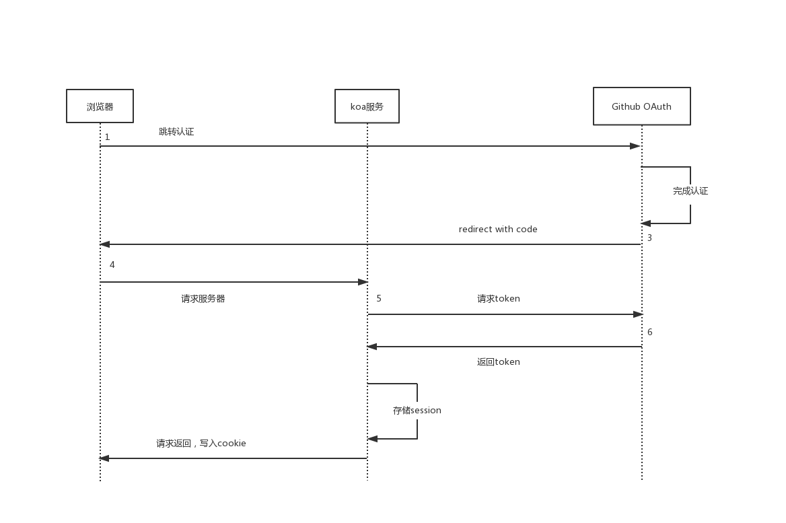

## 认证和授权
### 认证（Authentication）
&#8195;&#8195;所谓认证就是``如何证明你是你自己``的方式，一般来说证明你是你自己的方式就是通过身份证；而互联网中的认证通常用用户名和密码来证明你是你自己。  
&#8195;&#8195;常用的身份认证的方式一般有：
1. 用户名和密码登陆
2. 邮箱发送登陆链接
3. 手机号接收验证码
### 授权（Authorization）
&#8195;&#8195;所谓授权举个例子就是：你在安装手机应用的时候，应用会申请权限，你同意这个权限申请的过程就叫做``授权``。同理，在oauth中，被授权方会收获一定的权限。通常使用oauth的厂商有：
1. qq
2. 微信
3. 微博
4. 脸书
5. 推特
### 授权和认证的关系
&#8195;&#8195;授权并不一定需要认证。比如：当你有钥匙的时候，你就可以开门，你并不一定是这个屋子的主人。  
&#8195;&#8195;在互联网中的``oauth``授权通常来说是通过token进行权限的授予的。
## OAuth
### OAuth的概念
&#8195;&#8195;OAuth是互联网行业一种标准的授权方式。各个公司根据这一套标准实现自己的OAuth认证和授权流程，而第三方想要接入这个流程，就需要使用OAuth这套方案。  
&#8195;&#8195;OAuth目前有两个版本：
1. 1.x（已弃用）
2. 2.x（流行）
### 角色理解
&#8195;&#8195;OAuth第三方认证和授权流程中一般会有几个角色：
1. 客户端：浏览器端
2. 服务端：开发这个网站对应的服务器端
3. 授权服务器：提供OAuth第三方接入服务的提供商，比如QQ、微信等。  

&#8195;&#8195;另外一种说法说的是客户端和服务端可以合并称为被授权方，如果你做的是个纯客户端的OAuth接入的话，那么你也可以不需要服务端，不过这个接入方式安全性不高。  
### 授权方式
&#8195;&#8195;目前业界的OAuth授权方式有多种，其中最主要的是以下几种：
1. Authorization Code（最常用的）
2. Refresh Token：在授权Token未过期时，向OAuth接入方重新申请一个新的授权Token
3. Device Code：主要针对智能TV中的第三方接入。
4. Password：用OAuth提供方暴露的API，进行本网站的用户名和密码登陆。（不推荐，信任和安全，一般用于公司内部的登陆方式）
5. Implicit：已废弃
4. Client Credentials

#### Authorization Code
&#8195;&#8195;通过认证码的认证授权方式进行OAuth的接入时，主要流程分别是以下几步：
1. 客户端发起请求``redirect``到OAuth接入方并附带上``client_id``
2. 用户在``redirect``之后的网站上输入用户名和密码
3. 登陆成功之后，OAuth接入方会返回给服务端一个``code``。
4. 服务端拿到``code``之后，拿着``client_secret``和``code``向OAuth接入方申请获得``Token``
5. 服务端拿到Token之后，进入授权窗口
6. 授权成功，跳转到客户端网站。

### Github OAuth第三方接入
#### 注册Github OAuth
url:``https://github.com/settings/apps``  
1. 登陆github
2. 点击头像、setting
3. 点击developer setting
4. 新建OAuth App 
 
&#8195;&#8195;注意：HomePage URL在项目未上线之前填本地项目根路径地址，在项目上线之后填上线之后的域名地址；同理``Authorization callback URL``在上线之前填写``http://localhost:3000/auth``，在上线之后填写``域名+/auth``。  
&#8195;&#8195;注册成功之后，会出现一个client_id和client_secret，这个两个值非常重要。需要保存在项目文件之中
### OAuth字段详解
#### 跳转字段
**url**: ``https://github.com/login/oauth/authorize``  
**param**：
1. client_id：client_id是注册时的client_id
2. scope：希望得到的权限范围
3. redirect_uri：授权后重定向到项目的地址，必须和注册Github OAuth App时的``redirect uri``相同
4. login：用于登录和授权应用程序的特定帐户，如果你在此网站登陆过github并授权，则在此请求OAuth时免去登陆步骤。
5. state：不可猜测的随机字符串。它用于防止跨站点请求伪造攻击。
6. allow_signup：在OAuth流程中，是否向未认证的用户提供注册GitHub的选项。默认值为true。false在策略禁止注册的情况下使用。
#### 请求token
**url**: ``https://github.com/login/oauth/access_token``  
**param**：
1. client_id：必需，标明token使用方
2. client_secret：必需，标明token使用方
3. code：必需，代表用户已授权
4. redirect_uri：同上
5. state：同上

#### 请求用户信息
**url**: ``https://api.github.com/user``  
**header**：
1. Authorization：即请求access_token时返回的access_token，该字段统一是``token +access_token``
### Github OAuth授权如何保证安全
#### 策略
1. 一次性code：即授权成功时返回的code是一次性的，请求access_token后，上一次的code已失效。
2. id + secret验证方式：请求access_token时，不仅需要code，还需要client_id和client_secret，就算code已泄露，只要对方没有这两个字段那他就无法获取我方的access_token。
3. redirect_uri：这个字段是位于请求时返回的uri，如果这个字段与github的``Authorization callback URL``不同时，就会报错。
### 使用cookie和session存储token
当用户进行完了OAuth流程之后，将token保存于cookie和session中，这样用户就不需要每次切换页面时都去进行一次OAuth认证和授权。 
#### 存储cookie
koa框架存储cookie的方式:
```javascript
server.use(async (ctx, next) => {
  ctx.cookies.set('id', id, {
    httpOnly: true
  });
  await next()
})
```
#### 存储session
```javascript
const session = require('koa-session');
// 给cookie加密，加密之后的密文是jwt
server.keys = ['ainuo develop github apps'];
const SESSION_CONFIG = {
  // key为存储的字段名
  key: 'jid',
   // 当没有配置store时，session是以jwt存储在cookie中的
   // store:
};
// 使用session中间件
server.use(session(SESSION_CONFIG, server));
// 一般来说我们会单独暴露一个接口用于设置session。
router.get('/set/user', async ctx => {
    // 设置session
  ctx.session.user = {
    name: 'ainuo',
    age: 18
  };
  ctx.body = 'set session success'
});
```
### 将token存储到redis
#### 创建Store
```javascript
function getRedisSessionId(sessionId) {
  return `ssid:${sessionId}`
}

module.exports = class RedisSessionStore {
  constructor(client) {
    this.client = client
  }

  // 根据sessionId获取redis中存储的session数据
  async get(sessionId) {
    console.log('get session', sessionId);
    const id = getRedisSessionId(sessionId);
    const data = await this.client.get(id);
    if (!data) {
      return null
    }
    try {
      return JSON.parse(data);
    } catch (e) {
      console.log(e)
    }
  }

  // 存储session数据到redis
  async set(sessionId, sessionValue, lifetime) {
    console.log('set session', sessionId);
    const id = getRedisSessionId(sessionId);
    if (typeof lifetime === "number") {
      lifetime = Math.ceil(lifetime / 1000);
    }
    try {
      const sessionStr = JSON.stringify(sessionValue);
      if (lifetime) {
        await this.client.setex(id, lifetime, sessionStr)
      } else {
        await this.client.set(id, sessionStr)
      }
    } catch (e) {
      console.log(e)
    }
  }

  // 从redis中删除某个session
  async destroy(sessionId) {
    console.log('destroy session', sessionId);
    const id = getRedisSessionId(sessionId);
    await this.client.del(id)
  }
}
```
#### koa-session连接redis数据库
```javascript
const Redis = require('ioredis');
// 可以传入一些配置
const client = new Redis({});
server.keys = ['ainuo develop github apps'];
const SESSION_CONFIG = {
  key: 'jid',
    // 当没有配置store时，session是以jwt存储在cookie中的
   store: new RedisSessionStore(client),
   // maxAge: 10 * 1000,
};
// 对服务端的session进行加密
server.use(session(SESSION_CONFIG, server));
// 删除session时删除redis数据库中的ssid:xxx的数据
router.get('/del/user', async ctx => {
    // 设置session
    ctx.session = null;
    ctx.body = 'del session success'
});
// 设置session时添加session到redis数据库
router.get('/set/user', async ctx => {
  // 设置session
  ctx.session.user = {
    name: 'ainuo',
    age: 18
  };
  ctx.body = 'set session success'
});
```
### koa接入Github OAuth
```javascript
//config,js
module.exports = {
  github: {
    client_id: '170b16e19a6b3034227d',
    client_secret: '521f1257450ff42f99cf817eb18de606b9002fd5',
    request_token_url: 'https://github.com/login/oauth/access_token',
    auth_url: 'https://github.com/login/oauth/authorize',
    scope: 'user',
    user_info_url: 'https://api.github.com/user'
  }
};


// auth.js
const axios = require('axios');
const {github} = require('../config');
const {client_id, client_secret, request_token_url} = github;
module.exports = function (server) {
  server.use(async (ctx, next) => {
    if (ctx.path === '/auth') {
      const code = ctx.query.code;
      if (code) {
        const res = await axios({
          method: 'POST',
          url: request_token_url,
          data: {
            client_id,
            client_secret,
            code
          },
          headers: {
            Accept: 'application/json',
          }
        });
        if (res.status === 200 && !(res.data && res.data.error)) {
          ctx.session.githubAuth = res.data;
          const {access_token, token_type} = res.data;
          const userInfoRes = await axios({
            method: 'GET',
            url: github.user_info_url,
            headers: {
              Authorization: `token ${access_token}`
            }
          });
          ctx.session.userInfo = userInfoRes.data;
          ctx.redirect('/');
        } else {
          const errorMsg = res.data && res.data.error;
          ctx.body = `request token failed ${errorMsg}`
        }
      } else {
        ctx.body = 'code not exist';
      }
    } else {
      await next()
    }
  })
};

// server.js
// 对服务端的session进行加密
server.use(session(SESSION_CONFIG, server));
// 配置处理github oauth登陆
auth(server);
```
